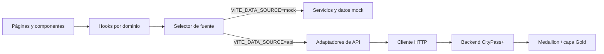

# Arquitectura y flujo de datos

## Responsabilidad de la aplicación

El frontend presenta tableros de reclamos, emergencias, movilidad, espacios
públicos y cultura, y residuos. La interfaz no consulta Azure directamente:
cuando trabaja con datos reales, toda lectura pasa por el backend de analítica.



## Capas del código

| Ruta | Responsabilidad |
| --- | --- |
| `src/pages/` | Compone cada tablero y sus estados visuales. |
| `src/components/` | Componentes compartidos, gráficos y vistas de dominio. |
| `src/hooks/` | Carga asíncrona, filtros y estado de interfaz. |
| `src/dataSources/` | Selecciona `mock` o `api` y adapta la respuesta del backend. |
| `src/api/` | Cliente HTTP, rutas de API y contratos recibidos. |
| `src/services/` | Cálculos de métricas y agregaciones para la interfaz. |
| `src/data/mocks/` | Datos locales usados en modo mock. |
| `src/types/` | Tipos internos compartidos por la aplicación. |
| `src/router/` | Rutas de React Router. |
| `src/__tests__/` | Pruebas unitarias y de integración de componentes. |

## Rutas de la interfaz

| Ruta | Pantalla |
| --- | --- |
| `/` | Redirige a `/analytics`. |
| `/analytics` | Resumen de dominios analíticos. |
| `/analytics/claims` | Reclamos. |
| `/analytics/emergencies` | Seguridad y emergencias. |
| `/analytics/mobility` | Movilidad urbana. |
| `/analytics/culture` | Espacios públicos y cultura. |
| `/analytics/waste` | Gestión de residuos. |

Las rutas se cargan de forma diferida. En el contenedor Nginx devuelve
`index.html` para rutas desconocidas por el servidor, permitiendo que React
Router resuelva una recarga directa.

## Estados de datos

Los hooks de dominio reutilizan `useAsync` y exponen datos, carga, error y
reintento. Para revisar visualmente los estados durante el desarrollo se puede
agregar a una ruta:

```text
?uiState=loading
?uiState=error
?uiState=empty
?uiState=success
```

Este parámetro solo modifica la representación visual; no cambia la fuente de
datos configurada.
